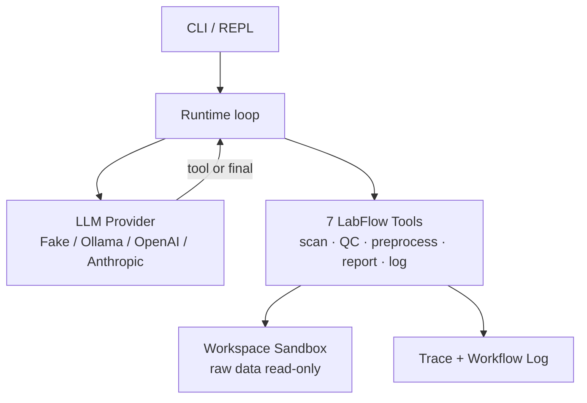
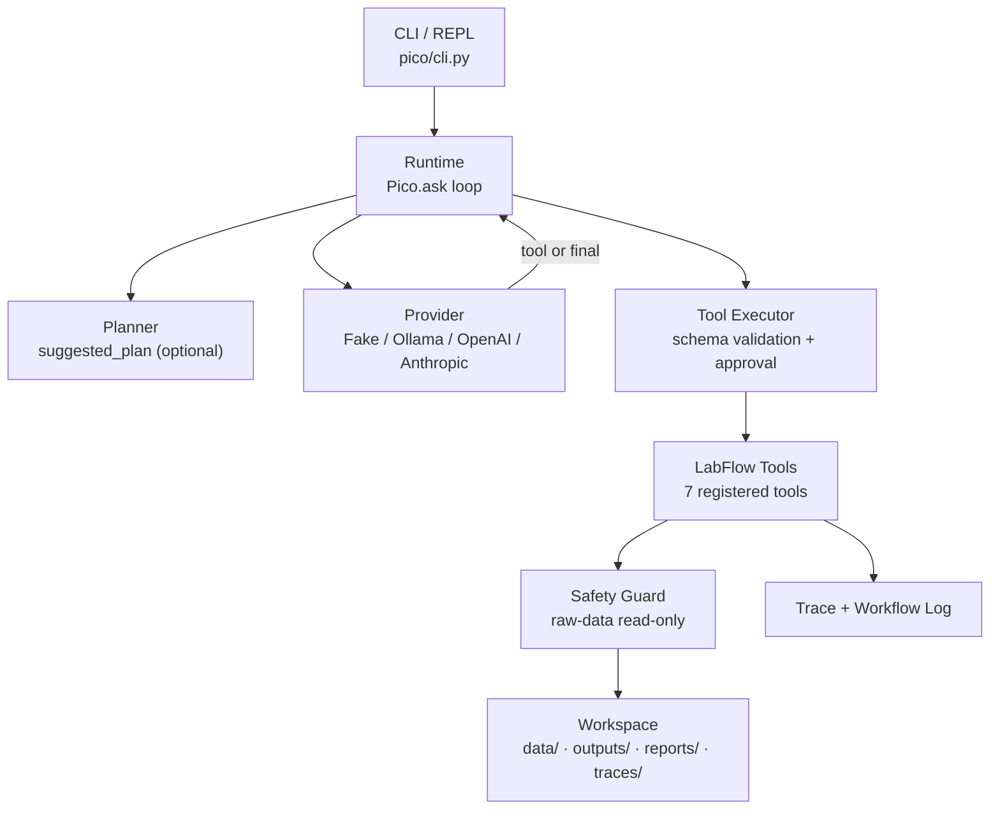
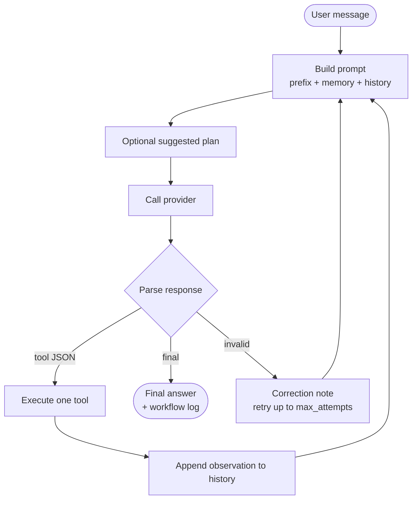
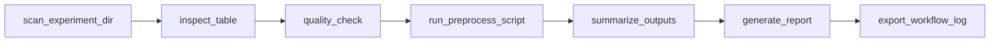
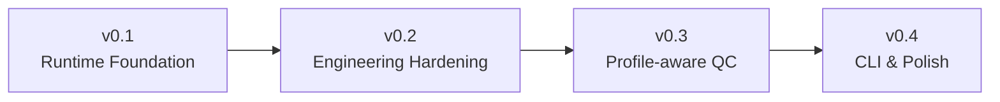

# LabFlow Agent

**Local-first, zero-dependency agent that turns messy experimental batches into auditable QC reports.**

LabFlow Agent drives an LLM through a fixed set of safe tools to scan experiment
directories, run rule-based quality checks, call whitelisted preprocessing scripts,
summarize results, generate Markdown reports, and export JSON workflow logs - all inside a
sandboxed workspace where raw data is strictly read-only.



---

## Why this project

After a lab finishes a batch of Raman / FTIR / XRF / UV-Vis experiments, the raw output is
a pile of metadata tables, spectrum CSVs, instrument logs, and intermediate files. Manual
cleanup is repetitive and error-prone: mismatched sample IDs, missing fields, duplicate
samples, missing files, non-standard names, numeric anomalies, and slow report assembly.

LabFlow Agent automates these repetitive checks **and** preserves a traceable evidence chain
- so a reviewer can see exactly which rule fired, on which sample, with what evidence, and
reproduce the run.

### Why not LangChain?

LabFlow is not an orchestration framework; it is a **vertical workflow**. LangChain gives
you flexible chains and agents; LabFlow gives you a *fixed, auditable* pipeline of safe
tools purpose-built for experimental-batch QC:

- **One action per turn**, deterministic XML protocol - replayable and inspectable, not a
  free-form ReAct soup.
- **Sandboxed**: the model can never touch raw data or run arbitrary shell; every effect is
  a guarded tool call.
- **Zero runtime dependencies** - installable in air-gapped lab environments with just the
  standard library.
- **Rule-based, not hallucinated** - findings are deterministic QC evidence, not LLM
  opinions about your data.

### Why an XML tool protocol instead of function calling?

A plain `<tool>{"name":...,"args":...}</tool>` / `<final>...</final>` protocol needs only
text generation. That means the **same loop runs on the offline `FakeModelClient` and on
real providers** (Ollama / OpenAI-compatible / Anthropic-compatible), so the entire pipeline
is unit-testable and deterministic without spending tokens.

### Why is this good for scientific data?

Every finding is a row in `qc_summary.csv` with sample, file, check, severity, and evidence;
every run becomes a `traces/<batch>_workflow_log.json` with per-tool timing and inputs. The
evaluator computes Precision / Recall / F1 against ground-truth labels and counts
**raw-data miswrites (must be 0)**. For scientific work, *auditability* matters as much as
*accuracy*.

---

## Core features

- **Local-first** - runs entirely on your machine; no data leaves the workspace unless you
  point a provider at an external API.
- **Zero runtime dependencies** - `pyproject.toml` declares `dependencies = []`; only the
  Python standard library is needed at runtime.
- **XML Tool Protocol** - provider-agnostic, deterministic, fully testable with the offline
  fake provider.
- **Scientific QC Workflow** - 10 rule-based checks across metadata, file consistency, and
  spectra (numeric anomalies, monotonicity, point count, robust MAD outlier detection).
- **Workspace Sandbox** - raw data under `data/raw` and `data/batch_*` is read-only and
  enforced; derived artifacts are confined to `outputs/`, `reports/`, `traces/`.
- **Configurable QC Profiles** - `negative_intensity` severity adapts to the data stage
  (raw / processed / baseline-corrected), surfaced via tool arg and `--qc-profile` CLI.
- **Deterministic Reports** - templated, localized (zh/en) Markdown reports; same inputs
  produce the same outputs.
- **Tracing & Workflow Logs** - every tool turn is a trace event; a batch-scoped JSON
  workflow log records inputs, outputs, status, and timing.
- **Robustness** - typed provider errors, exponential-backoff retry, session/run-store
  recovery, optional planner, pluggable context truncation.
- **CI** - lint + 3.10/3.11/3.12 test matrix + safety gate on every push.

---

## Architecture



The LLM never touches the filesystem directly - every effect goes through a registered tool
whose write path is guarded by `assert_raw_data_readonly`. Generic `run_shell` /
`write_file` / `patch_file` exist only for the safety test-suite and are **not** exposed in
the LabFlow registry.

See [docs/architecture.md](docs/architecture.md) for the full module breakdown.

## Agent loop



One action per turn, fully replayable. See [docs/agent-loop.md](docs/agent-loop.md).

## QC workflow



Seven tools, each leaving an auditable artifact (`qc_summary.csv`, `preprocessed/`,
`*_qc_report.md`, `*_workflow_log.json`). See [docs/workflow.md](docs/workflow.md).

---

## Quick start

### Install

```bash
git clone <repo>
cd labflow-agent
pip install -e ".[dev]"     # dev adds pytest + ruff; runtime has 0 dependencies
```

Requires Python >= 3.10. Runtime needs only the standard library.

### Run a demo batch (deterministic, no model needed)

The fake provider replays a scripted workflow, so this runs offline and produces identical
outputs every time:

```bash
python -m pico --approval auto --provider fake --max-steps 7 --fake-script '<tool>{"name":"scan_experiment_dir","args":{"experiment_dir":"data/batch_demo_001","batch_id":"batch_demo_001"}}</tool>||<tool>{"name":"inspect_table","args":{"path":"data/batch_demo_001/metadata.csv","max_rows":5}}</tool>||<tool>{"name":"quality_check","args":{"experiment_dir":"data/batch_demo_001","batch_id":"batch_demo_001"}}</tool>||<tool>{"name":"run_preprocess_script","args":{"script_name":"normalize_csv.py","batch_id":"batch_demo_001","mode":"batch","input_dir":"data/batch_demo_001/spectra","input_glob":"*.csv","output_suffix":"_normalized.csv","skip_critical":true}}</tool>||<tool>{"name":"summarize_outputs","args":{"batch_id":"batch_demo_001"}}</tool>||<tool>{"name":"generate_report","args":{"batch_id":"batch_demo_001"}}</tool>||<tool>{"name":"export_workflow_log","args":{"batch_id":"batch_demo_001"}}</tool>||<final>LabFlow full workflow completed for batch_demo_001.</final>' "Run full LabFlow workflow for data/batch_demo_001"
```

Expected outputs:

```text
outputs/batch_demo_001/qc_summary.csv
outputs/batch_demo_001/preprocess_summary.csv
outputs/batch_demo_001/preprocessed/
reports/batch_demo_001_qc_report.md
traces/batch_demo_001_workflow_log.json
```

### Use a real model

```bash
# OpenAI-compatible (incl. DeepSeek), Ollama, or Anthropic-compatible
python -m pico --provider openai-compatible --model gpt-4.1 "QC data/batch_demo_001 and generate a report"
```

### CLI flags

| Flag | Purpose |
|---|---|
| `--provider` | `fake` (default) / `ollama` / `openai-compatible` / `anthropic-compatible` |
| `--approval` | `never` / `ask` (default) / `auto` |
| `--max-steps` | tool steps per run (default 8) |
| `--no-planner` | disable the suggested-plan guidance layer |
| `--stream` | replay the final answer token-by-token |
| `--lang zh\|en` | report language (default zh) |
| `--qc-profile raw_spectrum\|processed_spectrum\|baseline_corrected` | QC profile default (default raw_spectrum) |
| `--fake-script` | offline scripted responses (`||`-separated), for deterministic demos |

### Generate the demo batches

```bash
python scripts/generate_demo_batches.py --batches 5 --samples-per-batch 20 --seed 42
```

---

## Real-data validation

LabFlow is cross-validated against **real public MOF Raman spectra** from the
[IBM/uRaman-Dataset](https://github.com/IBM/uRaman-Dataset) (CDLA-Sharing-1.0 license):
HKUST-1 and Mg-MOF74, imported into `data/batch_public_mof_001/`.

The cross-validation surfaced a real calibration gap that synthetic fixtures could not:
Mg-MOF74 is **baseline-corrected**, so 35.8% of its points are negative - expected baseline
noise, not a defect. Under the default `raw_spectrum` profile this produced 989
`negative_intensity` critical findings; the configurable `baseline_corrected` profile
collapses them into one auditable warning. This is the point of validating against real
data. See [docs/real-data-validation.md](docs/real-data-validation.md) and the full
[real-data cross-validation report](docs/real-data-cross-validation.md).

---

## Benchmark

| Metric | Value |
|---|---|
| **Precision / Recall / F1** | **1.000 / 1.000 / 1.000** |
| True positives / FP / FN | 55 / 0 / 0 |
| Batches / Samples | 5 / 105 |
| Report field coverage | 1.000 |
| Raw-data miswrite count | **0** |
| Tests passing | 140 passed, 4 skipped (gated integration) |
| `ruff check .` / `ruff format --check .` | clean |
| Runtime dependencies | 0 |

All numbers are produced by running the evaluation in this repo - see
[docs/benchmark.md](docs/benchmark.md) to reproduce. No RAG/retrieval metrics are reported
because there is no retrieval subsystem; no real-model latency is committed because it is
environment-dependent.

---

## Roadmap



| Version | Date | Summary |
|---|---|---|
| v0.1 | (pre-tag) | Agent runtime, XML protocol, 7 tools, synthetic benchmark |
| v0.2.1 | 2026-07-06 | Phases 1-4 hardening (typed errors, retry, planner, CI, streaming) + MAD fix |
| v0.3.0 | 2026-07-07 | Configurable QC profiles + real MOF cross-validation |
| v0.4.0 | 2026-07-13 | `--qc-profile` CLI threading + documentation refresh |

Full version history: [docs/release-history.md](docs/release-history.md) and
[CHANGELOG.md](CHANGELOG.md).

---

## Documentation

| Doc | What it covers |
|---|---|
| [docs/architecture.md](docs/architecture.md) | Module layout, layers, safety, providers |
| [docs/agent-loop.md](docs/agent-loop.md) | `Pico.ask()` control flow and limits |
| [docs/workflow.md](docs/workflow.md) | The 7-step QC workflow and QC rules |
| [docs/real-data-validation.md](docs/real-data-validation.md) | Real MOF Raman cross-validation |
| [docs/benchmark.md](docs/benchmark.md) | All metrics and how to reproduce them |
| [docs/release-history.md](docs/release-history.md) | Version timeline |

---

## Safety boundaries

- `data/raw` and `data/batch_*` are **read-only** inputs; preprocessing scripts cannot
  overwrite them (`assert_raw_data_readonly` raises `SafetyViolationError`).
- Derived artifacts enter only `outputs/<batch_id>/`, `reports/<batch_id>_qc_report.md`,
  and `traces/<batch_id>_workflow_log.json`.
- Preprocessing scripts must be whitelisted (currently `normalize_csv.py`).
- `batch_id` is sanitized to safe characters to prevent path traversal.
- Generic `run_shell` / `write_file` / `patch_file` are **not** exposed in the LabFlow
  registry.

## Tool registry

The default LabFlow registry exposes 7 tools: `scan_experiment_dir`,
`inspect_table`, `quality_check`, `run_preprocess_script`, `summarize_outputs`,
`generate_report`, `export_workflow_log`. To add a tool, see
[CONTRIBUTING.md](CONTRIBUTING.md).

## Development verification

```bash
python -m compileall pico scripts evaluate_qc.py
python -m pytest
ruff check .
ruff format --check .
```

See [CONTRIBUTING.md](CONTRIBUTING.md) for the development setup and safety rules.

## Known limitations

- Demo and benchmark data are synthetic spectra with hand-injected anomalies.
- QC is rule-based, not a scientific conclusion.
- Primarily CSV-oriented; private instrument binary formats are out of scope.
- The preprocessing script (`normalize_csv.py`) is demo-level.
- The fake provider drives stable deterministic demos; real-model behavior depends on the
  model honoring the tool protocol.

## License

The LabFlow Agent source code is licensed under the **[MIT License](LICENSE)**.

Real public Raman data in `data/batch_public_mof_001/` is from the
[IBM/uRaman-Dataset](https://github.com/IBM/uRaman-Dataset) under
**CDLA-Sharing-1.0** (a separate, compatible data license that permits use,
modification, and redistribution). Synthetic demo fixtures are generated by
`scripts/generate_demo_batches.py` and are covered by the project's MIT License.

---

**LabFlow Agent** - turning "a folder full of spectra" into "an auditable QC report" with
zero runtime dependencies and a sandbox the model cannot escape.
