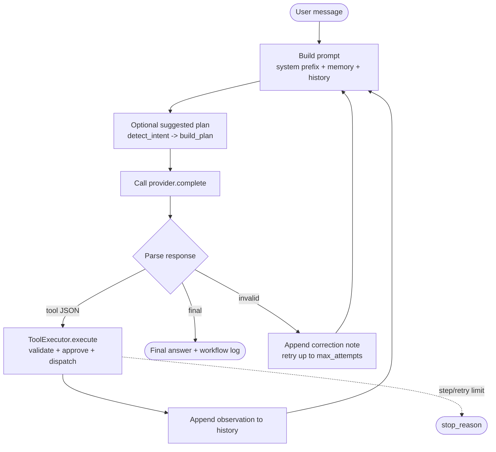

# Agent Loop

> The control flow of `Pico.ask()` in [`pico/runtime.py`](../pico/runtime.py).

LabFlow Agent uses a **single-turn, one-action-per-step** loop driven by a minimal XML
protocol. The model returns exactly one of `<tool>...</tool>` or `<final>...</final>` per
turn; the runtime executes one tool, appends its observation, and re-prompts. This is
deliberately simpler than a planner-driven multi-agent architecture: predictability and
auditability are the priority for scientific QC.

## Loop diagram

## Per-turn steps

1. **Prompt assembly** (`build_prompt_and_metadata`): the system prefix
   (`build_prompt_prefix`, cached by a workspace fingerprint), layered memory, rendered
   history, the user message, and - if the planner is on - a `suggested_plan` block.
2. **Provider call** (`model_client.complete`): wrapped so `ModelProviderError`
   (connection / rate-limit / auth / response) finishes the run with `provider_error`
   after draining retry events into the trace.
3. **Parse** (`parse`): the response is matched against `<tool>...</tool>` (must be a JSON
   object with `name` and `args`) then `<final>...</final>`. Anything else yields a
   `retry` with a targeted correction note.
4. **Tool execution** (`run_tool` -> `ToolExecutor.execute`): schema validation
   (`validate_tool_args`) -> repeat-signature guard -> approval policy (for risky tools) ->
   dispatch. Result metadata carries `batch_id`, which the runtime tracks as
   `current_batch_id`.
5. **Observation**: `result.to_observation()` (status + clipped text) is appended to
   history along with the raw model turn. Affected paths invalidate memory file summaries
   and may force a prefix rebuild.
6. **Loop or finish**: repeat until `<final>` (success), or until `max_steps` / `max_attempts`
   is hit (stopped with an explicit `stop_reason`).

## Limits and stop reasons

| Parameter | Default | Effect |
|---|---|---|
| `--max-steps` | 8 | tool steps per run; exceeded -> `step_limit_reached` |
| `max_attempts` | 3 | parser-retry budget per run; exceeded -> `retry_limit_reached` |
| `max_turns` | `max_steps + max_attempts + 1` | hard loop bound |

Provider errors abort the loop with `provider_error`; otherwise a `run_summary` and
`run_finished` trace event plus a run report are written, and - if a `batch_id` is known -
a `traces/<batch>_workflow_log.json` is compiled from the trace.

## Why one action per turn

- **Determinism**: each tool result is observable and replayable; the workflow log maps
  one-to-one onto tool turns.
- **Safety**: only one effectful action happens between human checkpoints (under
  `--approval ask`), and risky tools can be blocked per-policy.
- **Provider-agnostic**: the XML protocol needs only text generation, so the offline
  `FakeModelClient` and real providers share the exact same loop.

## The suggested-plan layer (optional)

`detect_intent` classifies the prompt (`qc_only`, `preprocess_only`, `report_only`,
`metadata_only`, `compare_batches`, `explain_finding`, `resume_failed_workflow`, ...).
`build_plan` maps the intent to an ordered tool list rendered as an *advisory*
`Suggested steps` block in the prompt. The model may deviate. Disable with `--no-planner`
for pure LLM-driven behavior. The plan is not a control-flow mechanism - the loop always
respects whatever single tool the model actually emits.
