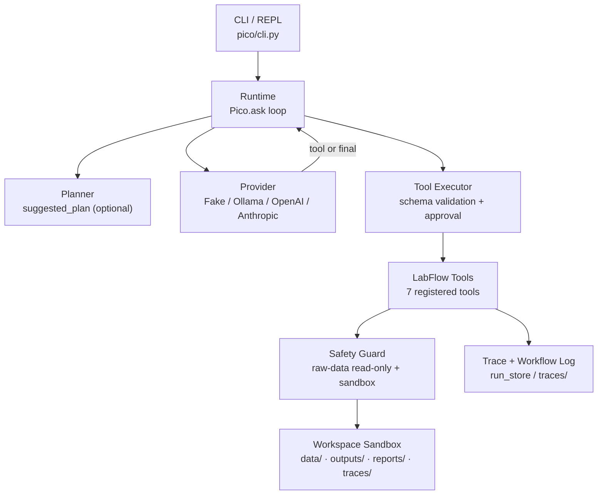

# Architecture

> Technical deep-dive. For an overview, see the [README](../README.md).

LabFlow Agent is a **local-first, zero-runtime-dependency** scientific-data workflow
assistant. It drives an LLM through a fixed set of safe tools to scan experiment
batches, run rule-based QC, call whitelisted preprocessing scripts, summarize results,
generate Markdown reports, and export JSON workflow logs - all inside a sandboxed
workspace with read-only raw data.

## System overview



Key design property: **the LLM never touches the filesystem directly.** Every effectful
action goes through a registered tool whose write path is guarded by
`assert_raw_data_readonly`. Generic `run_shell` / `write_file` / `patch_file` tools exist
in the codebase only for the safety test-suite and are **not** exposed in the LabFlow
registry.

## Module layout

```text
pico/
├── cli.py                 # argparse + REPL; threads --lang / --qc-profile
├── runtime.py             # Pico.ask() agent loop, trace events, workflow-log export
├── tool_executor.py       # validate_tool_args + approval policy + tool dispatch
├── tool_context.py        # ToolContext: root, path resolver, shell env, defaults
├── prompt_prefix.py       # system prompt + tool docs + workspace fingerprint
├── context_manager.py     # prompt assembly + truncation strategies
├── workflow_trace.py     # trace.jsonl -> LabFlow workflow log
├── task_state.py          # TaskState: attempts, tool steps, status
├── errors.py              # PicoError hierarchy + provider error classes
├── config.py              # defaults, env helpers, dotenv loader
├── workspace.py           # WorkspaceContext + git discovery + path resolution
├── agent/
│   ├── intent.py          # detect_intent
│   └── planner.py         # build_plan -> suggested_plan (advisory)
├── tools/
│   ├── labflow.py         # the 7 LabFlow tools + QC rules
│   ├── registry.py        # ToolSpec schemas + build_labflow_tool_registry
│   └── base.py            # ToolResult, ToolSpec, validate_tool_args
├── providers/
│   ├── clients.py         # Fake / Ollama / OpenAI / Anthropic clients
│   └── retry.py           # RetryConfig + with_retry (exp backoff)
├── features/
│   └── memory.py          # layered in-context + durable memory
└── safety/
    └── guard.py           # batch_id sanitize, output/preprocess/report/trace path resolve
```

Historical shim modules (`pico.labflow_tools`, `pico.tool_registry`, ...) re-export the
real implementations and emit `DeprecationWarning`.

## Layers

### 1. CLI / entry point (`pico/cli.py`)

`build_arg_parser()` exposes `--provider`, `--model`, `--approval`, `--max-steps`,
`--no-planner`, `--stream`, `--lang`, `--qc-profile`, plus fake-script and resume support.
`build_agent()` constructs a `Pico` instance, threading CLI flags into `Pico` fields
(`report_lang`, `qc_profile`, `use_planner`, ...) which in turn thread into
`ToolContext` defaults. Two CLI entry points are registered in `pyproject.toml`:
`labflow-agent` and `pico`, both pointing at `pico.cli:main`.

### 2. Runtime / agent loop (`pico/runtime.py`)

The `Pico.ask()` loop is the heart of the system. See [agent-loop.md](agent-loop.md) for
the full control flow. It builds the prompt (system prefix + memory + history + user
message + optional suggested plan), calls the provider, parses one of `<tool>...</tool>`
or `<final>...</final>`, executes the tool through `ToolExecutor`, appends the observation
to history, and repeats until a final answer is produced or step/retry limits are hit.
Every turn is emitted as a trace event; on completion a workflow log is written for the
current batch.

### 3. Tool protocol

The model communicates via a deliberately minimal **XML tool protocol** - no function
calling API, no structured-output schema on the wire, just:

```text
<tool>{"name":"quality_check","args":{"experiment_dir":"data/batch_demo_001"}}</tool>
```

or:

```text
<final>LabFlow workflow completed for batch_demo_001.</final>
```

`validate_tool_args` enforces each tool's JSON Schema **before** dispatch (unknown or
ill-typed arguments are rejected with `invalid_args`), and `shell_command_signature`
guards against an identical repeated call. This keeps the protocol provider-agnostic: any
model that can emit text works, including the offline `FakeModelClient`.

### 4. Tools (`pico/tools/`)

Seven registered tools form the canonical workflow:

| Tool | Reads | Writes |
|---|---|---|
| `scan_experiment_dir` | experiment dir | - |
| `inspect_table` | CSV | - |
| `quality_check` | metadata + spectra | `outputs/<batch>/qc_summary.csv` |
| `run_preprocess_script` | spectra | `outputs/<batch>/preprocessed/` (whitelisted script) |
| `summarize_outputs` | outputs/ | - |
| `generate_report` | qc_summary.csv | `reports/<batch>_qc_report.md` |
| `export_workflow_log` | trace.jsonl | `traces/<batch>_workflow_log.json` |

Only `run_preprocess_script` is flagged `risky=True` (it shells out to a whitelisted
script); all others are non-risky. See [workflow.md](workflow.md).

### 5. Safety (`pico/safety/guard.py`)

- **Raw data read-only**: `assert_raw_data_readonly(ctx.root, path)` raises
  `SafetyViolationError` if a derived-artifact write path would land under `data/raw` or
  `data/batch_*`. Enforced on every LabFlow write path.
- **Output confinement**: derived artifacts may only enter `outputs/`, `reports/`, or
  `traces/`, resolved through dedicated resolvers (`resolve_output_path`,
  `resolve_preprocessed_path`, `resolve_report_path`, `resolve_trace_path`).
- **`batch_id` sanitization**: `sanitize_batch_id` permits only safe characters,
  preventing path traversal.
- **Script whitelist**: `resolve_registered_script` only resolves scripts in
  `scripts/normalize_csv.py` (and registered peers); arbitrary shell is never exposed.
- **Safe shell env**: `safe_shell_env` exposes only a minimal allowlist of environment
  variables to preprocessing subprocesses.

### 6. Providers (`pico/providers/`)

Four clients share a `ModelClient` protocol: `FakeModelClient` (offline, scripted),
`OllamaModelClient`, `OpenAICompatibleModelClient`, `AnthropicCompatibleModelClient`.
Transient failures are classified into `ProviderConnectionError`,
`ProviderRateLimitError`, `ProviderAuthError`, `ProviderResponseError` and retried with
exponential backoff (`with_retry`, configurable via `PICO_MAX_RETRIES` /
`PICO_RETRY_BASE_DELAY_MS` / `PICO_RETRY_MAX_DELAY_MS`). Retry events are recorded in the
trace. Streaming line parsers (`parse_ollama_stream_line`, `parse_openai_stream_line`,
`parse_anthropic_stream_line`) are extracted and unit-tested.

### 7. Memory (`pico/features/memory.py`)

`LayeredMemory` combines in-context file summaries (refreshed/invalidated as tools touch
paths) with a durable `.pico/memory` store. The workspace fingerprint triggers prefix
rebuild when files change.

### 8. Tracing & workflow log

`run_store` appends one JSONL trace event per lifecycle step (`run_started`,
`prompt_built`, `model_completed`, `model_parsed`, `tool_finished`, `provider_retry`,
`run_summary`, `run_finished`). `build_workflow_log` compiles a batch-scoped
`traces/<batch>_workflow_log.json` with per-tool timing, inputs, outputs, status, and
`total_duration_seconds`.

## Why zero runtime dependencies

`pyproject.toml` declares `dependencies = []`. The runtime needs only the Python standard
library; provider HTTP calls use `urllib.request`. This keeps the agent installable in
restricted / air-gapped lab environments and makes the dependency surface auditable. Dev
dependencies are limited to `pytest` and `ruff`.

## Non-goals

- LabFlow is not a coding agent and does not expose arbitrary shell / file editing to the
  model.
- It does not train models or make scientific conclusions; findings are rule-based QC
  evidence requiring human review.
- It is CSV-centric for spectra; private instrument binary formats are out of scope.
