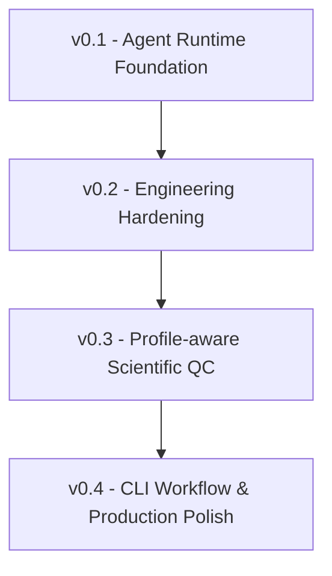

# Release History

> Concise version history. For full change detail see [CHANGELOG.md](../CHANGELOG.md).

## Timeline

| Version | Date | Tag | One-line summary |
|---|---|---|---|
| **v0.1** | (pre-tag) | - | Agent Runtime Foundation - local harness, XML tool protocol, LabFlow tool registry, synthetic benchmark |
| **v0.2.1** | 2026-07-06 | `v0.2.1` | Engineering Hardening - Phases 1-4 (typed errors, provider retry, planner, templated reports, truncation, CI, streaming) + `extreme_intensity` MAD fix |
| **v0.3.0** | 2026-07-07 | `v0.3.0` | Profile-aware Scientific QC - configurable QC profiles, real MOF Raman cross-validation |
| **v0.4.0** | 2026-07-13 | `v0.4.0` | CLI Workflow & Production Polish - `--qc-profile` CLI threading, end-to-end CLI workflow |

> v0.1 was the initial framework work and was never given a git tag; it is referenced here
> as the conceptual baseline. The first tagged release is `v0.2.1`.

## v0.1 - Agent Runtime Foundation (pre-tag)

- Local-first agent harness: `<tool>...</tool>` / `<final>...</final>` XML protocol.
- LabFlow tool registry with 7 tools (scan / inspect / quality_check / preprocess /
  summarize / generate_report / export_workflow_log).
- Synthetic multi-batch demo generator + label-based Precision/Recall/F1 evaluation.
- Workspace sandbox with read-only raw data; derived outputs confined to `outputs/`,
  `reports/`, `traces/`.
- Workflow trace + JSON workflow log export.

## v0.2.1 - Engineering Hardening (tagged `v0.2.1`, 2026-07-06)

- **Phase 1 - Cleanup & hardening**: typed `PicoError` hierarchy; `assert_raw_data_readonly`
  raises `SafetyViolationError` on all write paths; three-tier tool exception handling.
- **Phase 2 - Robustness**: provider error classification; HTTP-status mapping; exponential
  backoff retry; `SessionStore`/`RunStore` corrupt-JSON quarantine; retry events in traces.
- **Phase 3 - Architecture**: optional `<suggested_plan>` planner; templated report section
  titles; `generate_report` `lang` argument; pluggable `TruncationStrategy`
  (`PICO_TRUNCATION_STRATEGY`); tools reorganized into `pico/tools/`.
- **Phase 4 - Engineering**: GitHub Actions CI (lint + 3.10/3.11/3.12 matrix + safety);
  gated integration tests; `complete_stream()` + `--stream`; `run_summary` trace event.
- **Fix**: `extreme_intensity` switched from `pstdev` to robust MAD - recall `0.909`->`1.0`.

## v0.3.0 - Profile-aware Scientific QC (tagged `v0.3.0`, 2026-07-07)

- **Configurable QC profiles**: `quality_check` gains optional `qc_profile`
  (`raw_spectrum` (default) | `processed_spectrum` | `baseline_corrected`).
- `negative_intensity` becomes data-stage-aware: raw stays per-point critical;
  processed/baseline_corrected collapse to one auditable warning.
- `qc_summary.csv` gains a `qc_profile` column; the report shows the profile and a
  profile-aware advisory note.
- **Real public-data cross-validation**: IBM uRaman-Dataset MOF Raman (CDLA-Sharing-1.0)
  imported; surfaced and resolved the baseline-corrected negative-intensity calibration gap.
- Default behavior unchanged - synthetic benchmark stays P=R=F1=1.0.

## v0.4.0 - CLI Workflow & Production Polish (tagged `v0.4.0`, 2026-07-13)

- **`--qc-profile` CLI flag**: threads CLI -> `Pico.qc_profile` ->
  `ToolContext.default_qc_profile` -> `quality_check` default (mirrors `--lang`).
- `argparse` `choices` reject unknown profiles at parse time; explicit tool `qc_profile`
  still wins over the CLI default.
- Documentation refresh: restructured README, `docs/` technical deep-dives, Mermaid
  architecture/loop/workflow/timeline diagrams, consolidated benchmark.
- Backward compatible; no runtime or rule changes.
