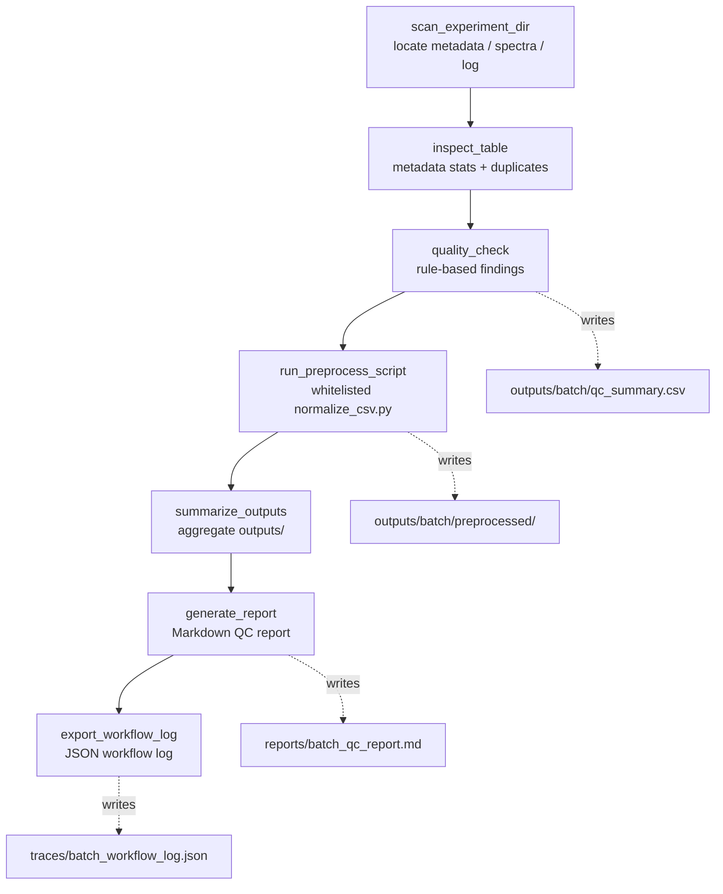

# QC Workflow

> The canonical 7-step LabFlow batch workflow. For tool semantics see
> [architecture.md](architecture.md); for the loop that drives it see
> [agent-loop.md](agent-loop.md).

A complete batch run walks the model through seven tools, each leaving an auditable
artifact. The pipeline is `scan -> inspect -> quality_check -> preprocess -> summarize ->
report -> workflow_log`.



## Steps

| # | Tool | Purpose | Artifact |
|---|---|---|---|
| 1 | `scan_experiment_dir` | Locate `metadata.csv`, `spectra/`, instrument log; flag suspicious filenames | scan summary (returned) |
| 2 | `inspect_table` | Column types, missing values, duplicate `sample_id`, numeric stats | inspect summary (returned) |
| 3 | `quality_check` | Rule-based QC over metadata + spectra; write findings | `outputs/<batch>/qc_summary.csv` |
| 4 | `run_preprocess_script` | Run whitelisted `normalize_csv.py` over spectra (skips critical samples by default) | `outputs/<batch>/preprocessed/*_normalized.csv` |
| 5 | `summarize_outputs` | Aggregate QC + preprocess results for the batch | summary (returned) |
| 6 | `generate_report` | Render a localized Markdown report | `reports/<batch>_qc_report.md` |
| 7 | `export_workflow_log` | Compile trace events into a batch workflow log | `traces/<batch>_workflow_log.json` |

## QC rules

`quality_check` (`pico/tools/labflow.py`) evaluates, per batch:

- **Metadata**: missing file/format, missing required fields (`sample_id`, `method`),
  empty `sample_id`, blank values, duplicate `sample_id`.
- **File consistency**: missing spectra dir/file, file without metadata, invalid filename
  (`sample_id_method.csv`).
- **Spectra**: missing `x`/`intensity` column, missing intensity, non-numeric `x` /
  `intensity`, `negative_intensity`, `x_not_monotonic`, `too_few_points` (`<10`),
  `extreme_intensity` (robust MAD-based 6-sigma outlier test, with stdev fallback).

Each finding is a row in `qc_summary.csv` with `finding_id`, `batch_id`, `sample_id`,
`file`, `check`, `severity` (`critical` / `warning`), `status`, `message`, `evidence`,
and `qc_profile`.

## QC profiles (v0.3+)

`negative_intensity` severity adapts to the data stage via the optional `qc_profile`
argument (or the `--qc-profile` CLI default, v0.4):

| Profile | `negative_intensity` | Use case |
|---|---|---|
| `raw_spectrum` (default) | per-point `critical` | raw instrument output (backward compatible) |
| `processed_spectrum` | collapsed single `warning` | processed / baseline-subtracted |
| `baseline_corrected` | collapsed single `warning` + baseline-noise note | baseline-corrected Raman |

Under non-raw profiles, negatives are still recorded (`evidence` carries `count` and
`min`) - only severity and explanation change. See
[real-data-validation.md](real-data-validation.md) for the calibration gap this addresses.

## Determinism and auditability

- The **same fake script + same inputs produce the same outputs** end-to-end; this is what
  the synthetic benchmark exploits to assert P=R=F1=1.0.
- Every turn is a trace event; the workflow log records per-tool `input`, `output_paths`,
  `metadata`, `status`, `error_code`, `duration_seconds`, plus `total_duration_seconds`.
- Raw data under `data/raw` and `data/batch_*` is never written by the pipeline
  (`assert_raw_data_readonly`); `raw_data_miswrite_count` in the evaluator verifies this.

## Run it

Single batch (fake provider, deterministic):

```bash
python -m pico --approval auto --provider fake --max-steps 7 --fake-script '<tool>{"name":"scan_experiment_dir","args":{"experiment_dir":"data/batch_demo_001","batch_id":"batch_demo_001"}}</tool>||<tool>{"name":"inspect_table","args":{"path":"data/batch_demo_001/metadata.csv","max_rows":5}}</tool>||<tool>{"name":"quality_check","args":{"experiment_dir":"data/batch_demo_001","batch_id":"batch_demo_001"}}</tool>||<tool>{"name":"run_preprocess_script","args":{"script_name":"normalize_csv.py","batch_id":"batch_demo_001","mode":"batch","input_dir":"data/batch_demo_001/spectra","input_glob":"*.csv","output_suffix":"_normalized.csv","skip_critical":true}}</tool>||<tool>{"name":"summarize_outputs","args":{"batch_id":"batch_demo_001"}}</tool>||<tool>{"name":"generate_report","args":{"batch_id":"batch_demo_001"}}</tool>||<tool>{"name":"export_workflow_log","args":{"batch_id":"batch_demo_001"}}</tool>||<final>LabFlow full workflow completed for batch_demo_001.</final>' "Run full LabFlow workflow for data/batch_demo_001"
```

Multi-batch evaluation against labels: see [benchmark.md](benchmark.md).
